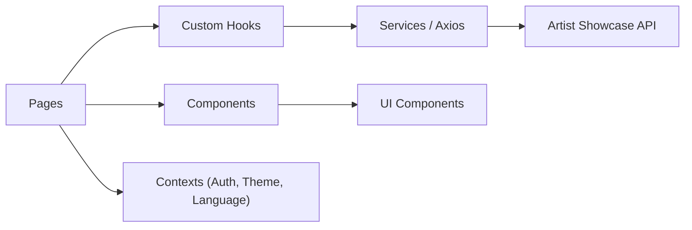

# 🎤 Artist Showcase UI

    [](https://choosealicense.com/licenses/mit/) [](https://github.com/users/willfelixd/projects/4)

> Interface web para o portfólio da cantora Isa — landing page pública
> e painel administrativo, com dark/light mode e suporte a pt-BR e English.

---

## 📌 Sobre o projeto

Este projeto consiste na interface web completa do portfólio da cantora Isa,
consumindo a Artist Showcase API. Inclui páginas públicas para o público
geral e um painel administrativo protegido para gerenciamento de conteúdo.

### 📋 Kanban

🗂️ **Acompanhe o progresso:** [Kanban - artist-showcase](https://github.com/users/willfelixd/projects/4)

<p>
  
</p>

> ⚠️ Projeto em desenvolvimento ativo. Novas funcionalidades serão adicionadas
> a cada fase.

---

## 🛠️ Tecnologias utilizadas

| Tecnologia | Uso no projeto |
|---|---|
| React 18 | Biblioteca principal de UI |
| TypeScript 5 | Tipagem estática |
| Vite | Bundler e servidor de desenvolvimento |
| React Router DOM | Roteamento client-side |
| Axios | Requisições HTTP com interceptors JWT |
| React Hook Form + Zod | Formulários e validação |
| i18next + react-i18next | Internacionalização pt-BR / English |
| Lucide React | Ícones SVG |
| date-fns | Manipulação e formatação de datas |
| GitHub Actions | CI automatizado |

---

## 🧱 Arquitetura do projeto

O projeto segue uma arquitetura em camadas:



As páginas consomem hooks customizados que encapsulam as chamadas aos
services. Os contexts gerenciam estado global de autenticação, tema e
idioma. Os components são reutilizáveis e desacoplados das páginas.

---

## 📈 Evolução do projeto

- [x] #1 Setup inicial do projeto
- [ ] #2 Tema dark/light mode
- [ ] #3 Internacionalização pt-BR / English
- [ ] #4 Página Home
- [ ] #5 Página Repertório
- [ ] #6 Página Vídeos
- [ ] #7 Página Agenda
- [ ] #8 Página Contato
- [ ] #9 Painel Admin
- [ ] #10 Deploy Vercel e CD

---

## ⚙️ Funcionalidades

### Páginas públicas
- ✅ Home com branding e perfil da artista
- ✅ Repertório com busca e filtro por gênero
- ✅ Vídeos com player do YouTube
- ✅ Agenda com calendário e formulário de agendamento
- ✅ Contato com formulário validado

### Painel Admin
- ✅ Login protegido com JWT
- ✅ Gerenciamento de perfil, músicas, vídeos e agenda
- ✅ Visualização de mensagens de contato

### Experiência
- ✅ Dark / Light mode com persistência
- ✅ Tradução pt-BR / English com detecção automática
- ✅ Design responsivo mobile-first

---

## ▶️ Como executar o projeto

### Pré-requisitos

- Node.js 20+
- Artist Showcase API rodando em `http://localhost:8080`

### 1. Clonar o repositório

```bash
git clone https://github.com/willfelixd/artist-showcase-ui.git
```

### 2. Entrar na pasta

```bash
cd artist-showcase-ui
```

### 3. Configurar variáveis de ambiente

```bash
cp .env.example .env.development

# Edite o arquivo com a URL da API
```

### 4. Instalar dependências

```bash
npm install
```

### 5. Rodar em desenvolvimento

```bash
npm run dev
```

Acesse `http://localhost:5173`

---

## 🔀 Fluxo de desenvolvimento

Este projeto segue o GitHub Flow adaptado com branch de desenvolvimento:

```
main (protegida — só via PR de release)
└── develop (branch principal de trabalho)
    └── feature/nome-da-feature
        ↓ commit
        ↓ push
        ↓ PR → develop
        ↓ CI passa
        ↓ merge
```

### Padrão de branches

| Branch | Descrição |
|---|---|
| `main` | Produção — protegida, só recebe PR de release |
| `develop` | Desenvolvimento — base para todas as features |
| `feature/*` | Nova funcionalidade — ex: `feature/dark-light-theme` |
| `hotfix/*` | Correção urgente em produção |

### Padrão de commits

Segui [Conventional Commits](https://www.conventionalcommits.org/):

```
feat: add dark/light theme system
feat: add i18n with pt-BR and English support
chore: update CI pipeline
docs: update README with demo screenshots
```

### Ciclo completo de uma feature

1. Criar Issue no GitHub
2. `git checkout develop`
3. `git checkout -b feature/nome-da-feature`
4. Desenvolver e commitar
5. `git push origin feature/nome-da-feature`
6. Abrir PR → develop com template
7. CI passa
8. Merge → develop
9. Deletar branch da feature

### Release para produção

```
develop → PR → main → CI/CD → deploy automático na Vercel
```

---

## 📁 Estrutura de pastas

```
src
├── 📂 assets          # Imagens e recursos estáticos
├── 🧩 components
│   ├── 🎨 ui          # Botões, inputs, cards genéricos
│   └── 🏗️ layout      # Header, Footer, Sidebar
├── 🌍 contexts        # Auth, Theme, Language
├── 🪝 hooks           # Custom hooks
├── 🌐 pages
│   ├── 🏠 Home
│   ├── 🎵 Repertoire
│   ├── 🎥 Videos
│   ├── 📅 Schedule
│   ├── 📞 Contact
│   └── 🔐 Admin
├── ⚙️ services        # Chamadas à API
├── 🏷️ types           # Interfaces TypeScript
└── 🛠️ utils           # Funções utilitárias
```

---

## 🧪 Testes

```bash
npm run build
```

O build inclui verificação completa de tipos TypeScript, erros de tipo
bloqueiam o CI antes de chegar em produção.

---

## 📸 Demonstração

*(Em breve — prints das páginas e do painel admin)*

<!--<p>
<p>
  
</p>

<p>
  
</p>
</p>-->

---

## 📚 Aprendizados

- Desenvolvimento de interfaces modernas com React 18 e TypeScript
- Arquitetura em camadas com separação de responsabilidades
- Autenticação JWT no frontend com interceptors Axios
- Internacionalização com i18next
- Dark/light mode com CSS variables e Context API
- Formulários com React Hook Form e validação com Zod
- CI com verificação de tipos TypeScript no GitHub Actions

---

## 🔗 Repositórios relacionados

* **Backend:** [artist-showcase-api](https://github.com/willfelixd/artist-showcase-api)

---

## 📄 Licença

[](https://choosealicense.com/licenses/mit/)

---

## ✍️ Autor

<table>
  <tr>
    <td align="center">
      <a href="https://github.com/willfelixd">
        
      </a><br/>
      <h6><a href="https://github.com/willfelixd"><b>William Felix</b></a><br/><br/>
      <a href="https://www.linkedin.com/in/william-felix-souza/">
        
      </a>
      <a href="mailto:willfelixd@gmail.com?subject=Proposta%20de%20Projeto&body=Olá,%20vi%20seu%20portfólio%20e%20gostaria%20de%20falar%20sobre%20um%20projeto.">
        
      </a>
    </td>
  </tr>
</table>