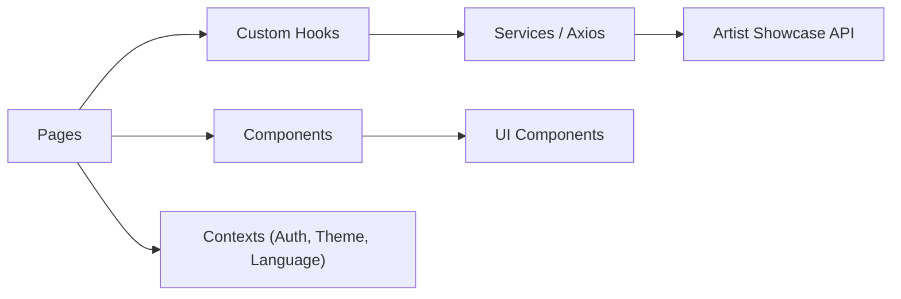

<p align="center">
  
</p>

<h1 align="center">🎤 Artist Showcase</h1>
<p align="center"><sub>🎨 UI</sub></p>

<p align="center">
  Interface web para o portfólio digital da cantora <strong>Isa Tavares</strong>,
  consumindo a <a href="https://github.com/willfelixd/artist-showcase-api">Artist Showcase API</a>.
</p>

          [](https://github.com/users/willfelixd/projects/4) [](https://choosealicense.com/licenses/mit/)    

> Interface web para o portfólio da artista — landing page pública
> e painel administrativo, com dark/light mode e suporte a pt-BR e English.

---

### 🌐 Produção

> Frontend em produção na Vercel com deploy automático via GitHub Actions.

| | Link |
|---|---|
| 🎤 **Site** | [artist-showcase-ui.vercel.app](https://artist-showcase-ui.vercel.app) |
| ⚙️ **API** | [artist-showcase-api.onrender.com](https://artist-showcase-api.onrender.com/api/health) |

---

### 📌 Sobre o projeto

Este projeto consiste na interface web completa do portfólio da artista,
consumindo a Artist Showcase API. Inclui páginas públicas para o público
geral e um painel administrativo protegido para gerenciamento de conteúdo.

#### 📋 Kanban

🗂️ **Acompanhe o progresso:** [Kanban - artist-showcase](https://github.com/users/willfelixd/projects/4)

<p>
  
</p>

> ✅ Frontend — concluído e em produção na Vercel.

---

### ⚙️ Funcionalidades

### Páginas públicas
- ✅ Home com branding e perfil da artista
- ✅ Repertório com busca e filtro por gênero
- ✅ Player de áudio integrado para prévia das músicas (via Cloudinary)
- ✅ Modal com a letra de cada música
- ✅ Vídeos com player do YouTube
- ✅ Agenda com calendário e formulário de agendamento
- ✅ Contato com formulário validado

### Painel Admin
- ✅ Login protegido com JWT
- ✅ Gerenciamento de perfil, músicas (com áudio e letra), vídeos e agenda
- ✅ Visualização de mensagens de contato

### Experiência
- ✅ Dark / Light mode com persistência
- ✅ Tradução pt-BR / English com detecção automática
- ✅ Design responsivo mobile-first

---

### 🛠️ Tecnologias utilizadas
<details>
<summary><i>Clique aqui para ver o conteúdo</i></summary>

<br/>

| Tecnologia | Uso no projeto |
|---|---|
| React 18 | Biblioteca principal de UI |
| TypeScript 5 | Tipagem estática |
| Vite | Bundler e servidor de desenvolvimento |
| React Router DOM | Roteamento client-side |
| Axios | Requisições HTTP com interceptors JWT |
| React Hook Form + Zod | Formulários e validação |
| i18next + react-i18next | Internacionalização pt-BR / English |
| Lucide React | Ícones SVG |
| date-fns | Manipulação e formatação de datas |
| GitHub Actions | CI/CD automatizado |
| Vercel | Deploy e hospedagem do frontend |

</details>

---

### 🧱 Arquitetura do projeto
<details>
<summary><i>Clique aqui para ver o conteúdo</i></summary>

<br/>

O projeto segue uma arquitetura em camadas:


```mermaid
flowchart LR
    Pages["Pages"] --> Components["Components"]
    Pages --> Hooks["Custom Hooks"]
    Hooks --> Services["Services / Axios"]
    Services --> API["Artist Showcase API"]
    Pages --> Contexts["Contexts (Auth, Theme, Language)"]
    Components --> UI["UI Components"]
```

As páginas consomem hooks customizados que encapsulam as chamadas aos
services. Os contexts gerenciam estado global de autenticação, tema e
idioma. Os components são reutilizáveis e desacoplados das páginas.

O player de áudio consome o campo `audioUrl` retornado pela API (armazenado
no Cloudinary), e o modal de letra consome o campo `lyrics` da música,
carregado sob demanda ao abrir o modal, sem sobrecarregar a listagem.

</details>

---

### 📈 Evolução do projeto
<details>
<summary><i>Clique aqui para ver o conteúdo</i></summary>

<br/>

- [x] #1 Setup inicial do projeto
- [x] #2 Tema dark/light mode
- [x] #3 Internacionalização pt-BR / English
- [x] #4 Página Home
- [x] #5 Página Repertório
- [x] #6 Página Vídeos
- [x] #7 Página Agenda
- [x] #8 Página Contato
- [x] #9 Painel Admin
- [x] #10 Deploy Vercel e CD
- [x] #11 Integração com letras das músicas
- [x] #12 Integração com `audioUrl` / Cloudinary

</details>

---

### ▶️ Como executar o projeto
<details>
<summary><i>Clique aqui para ver o conteúdo</i></summary>

<br/>

### Pré-requisitos

- Node.js 20+
- Artist Showcase API rodando em `http://localhost:8080`

### 1. Clonar o repositório

```bash
git clone https://github.com/willfelixd/artist-showcase-ui.git
```

### 2. Entrar na pasta

```bash
cd artist-showcase-ui
```

### 3. Configurar variáveis de ambiente

```bash
cp .env.example .env.development

# Edite o arquivo com a URL da API
```

### 4. Instalar dependências

```bash
npm install
```

### 5. Rodar em desenvolvimento

```bash
npm run dev
```

Acesse `http://localhost:5173`

</details>

---

### 🔀 Fluxo de desenvolvimento
<details>
<summary><i>Clique aqui para ver o conteúdo</i></summary>

<br/>

Este projeto segue o GitHub Flow adaptado com branch de desenvolvimento:

```
main (protegida — só via PR de release)
└── develop (branch principal de trabalho)
    └── feature/nome-da-feature
         ↓ commit
         ↓ push
         ↓ PR → develop
         ↓ CI passa
         ↓ merge
         ↓ git checkout develop
         ↓ git pull origin develop       ← atualiza o local
         ↓ git branch -d feature/nome    ← deleta a branch local
```

### Padrão de branches

| Branch | Descrição |
|---|---|
| `main` | Produção — protegida, só recebe PR de release |
| `develop` | Desenvolvimento — base para todas as features |
| `feature/*` | Nova funcionalidade — ex: `feature/dark-light-theme` |
| `hotfix/*` | Correção urgente em produção |

### Padrão de commits

[Conventional Commits](https://www.conventionalcommits.org/):

```
feat: add dark/light theme system
feat: add i18n with pt-BR and English support
chore: update CI pipeline
docs: update README with demo screenshots
```

### Ciclo completo de uma feature

1. Criar Issue no GitHub
2. `git checkout develop`
3. `git checkout -b feature/nome-da-feature`
4. Desenvolver e commitar
5. `git push origin feature/nome-da-feature`
6. Abrir PR → develop com template
7. CI passa
8. Merge → develop
9. Deletar branch da feature

### Release para produção

```
develop → PR → main → CI/CD → deploy automático na Vercel
```

</details>

---

### 🔌 Integração com a API
<details>
<summary><i>Clique aqui para ver o conteúdo</i></summary>

<br/>

O frontend consome a Artist Showcase API através dos services Axios.

### Principais recursos consumidos

| Recurso                           | Uso no frontend                       |
| --------------------------------- | ------------------------------------- |
| `/api/auth/login`                 | Login administrativo                  |
| `/api/artist`                     | Perfil da artista                     |
| `/api/songs`                      | Repertório                            |
| `/api/songs/most-requested`       | Músicas mais pedidas                  |
| `/api/songs/{id}`                 | Detalhes da música e letra            |
| `/api/videos`                     | Lista de vídeos                       |
| `/api/videos/featured`            | Vídeos em destaque                    |
| `/api/videos/{id}`                | Detalhes do vídeo                     |
| `/api/bookings/unavailable-dates` | Datas indisponíveis                   |
| `/api/bookings`                   | Solicitação e gerenciamento de agenda |
| `/api/contact`                    | Mensagens de contato                  |

### Integração de áudio

As músicas podem possuir um `audioUrl` fornecido pela API.

O arquivo de áudio é hospedado externamente, atualmente utilizando\
Cloudinary, enquanto a URL é armazenada no backend.

```text
Frontend
   ↓
Artist Showcase API
   ↓
audioUrl
   ↓
Cloudinary
   ↓
Player de áudio
```

### Integração de letras

As letras são obtidas através da consulta individual da música:

```text
GET /api/songs/{id}
```

Isso permite que o frontend carregue os dados completos da música quando\
necessário, evitando carregar a letra em todas as listagens.

</details>

---

### 📁 Estrutura de pastas
<details>
<summary><i>Clique aqui para ver o conteúdo</i></summary>

<br/>

```
src
├── 📂 assets          # Imagens e recursos estáticos
├── 🧩 components
│   ├── 🎨 ui          # Botões, inputs, cards genéricos
│   └── 🏗️ layout      # Header, Footer, Sidebar
├── 🌍 contexts        # Auth, Theme, Language
├── 🪝 hooks           # Custom hooks
├── 🌐 pages
│   ├── 🏠 Home
│   ├── 🎵 Repertoire
│   ├── 🎥 Videos
│   ├── 📅 Schedule
│   ├── 📞 Contact
│   └── 🔐 Admin
├── ⚙️ services        # Chamadas à API
├── 🏷️ types           # Interfaces TypeScript
└── 🛠️ utils           # Funções utilitárias
```

Arquivos de configuração importantes:

```text
.
├── .github/
│   └── workflows/
│       ├── ci.yml           # Pipeline de integração contínua
│       └── cd.yml           # Deploy automático
├── public/                  # Arquivos públicos
├── src/                     # Código-fonte
├── .env.example             # Exemplo de variáveis
├── package.json             # Dependências e scripts
├── tsconfig.json            # Configuração TypeScript
├── vite.config.ts           # Configuração Vite
└── vercel.json              # Configuração SPA / Vercel
```

</details>

---

### 🧪 Testes
<details>
<summary><i>Clique aqui para ver o conteúdo</i></summary>

<br/>

```bash
npm run build
```

O build inclui verificação completa de tipos TypeScript, erros de tipo
bloqueiam o CI antes de chegar em produção.

</details>

---

### 📸 Demonstração
<details>
<summary><i>Clique aqui para ver o conteúdo</i></summary>

<br/>

Home:
<p>
  
</p>

Player de música:
<p>
  
</p>

Vídeos:
<p>
  
</p>

Painel Admin:
<p>
  
</p>

Acesso administrativo:
<p>
  
</p>

</details>

---

### 📚 Aprendizados
<details>
<summary><i>Clique aqui para ver o conteúdo</i></summary>

<br/>

- Desenvolvimento de interfaces modernas com React 18 e TypeScript
- Arquitetura em camadas com separação de responsabilidades
- Autenticação JWT no frontend com interceptors Axios
- Internacionalização com i18next
- Dark/light mode com CSS variables e Context API
- Formulários com React Hook Form e validação com Zod
- Integração de player de áudio e modal de letras a partir de campos da API
- CI/CD com GitHub Actions e deploy automático na Vercel

</details>

---

### 🔗 Repositórios relacionados

* **Backend:** [artist-showcase-api](https://github.com/willfelixd/artist-showcase-api)

---

### 📄 Licença

[](https://github.com/willfelixd/artist-showcase-ui/tree/main?tab=MIT-1-ov-file)

---

### ✍️ Autor

<table>
  <tr>
    <td align="center">
      <a href="https://github.com/willfelixd">
        
      </a><br/>
      <b>William Felix</b><br/>
      <a href="https://www.linkedin.com/in/william-felix-souza/">
        
      </a>
      <a href="mailto:willfelixd@gmail.com?subject=Proposta%20de%20Projeto&body=Olá,%20vi%20seu%20portfólio%20e%20gostaria%20de%20falar%20sobre%20um%20projeto.">
        
      </a>
    </td>
  </tr>
</table>